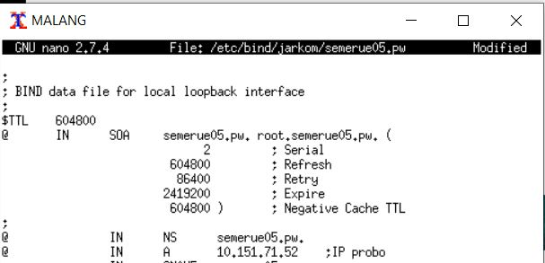
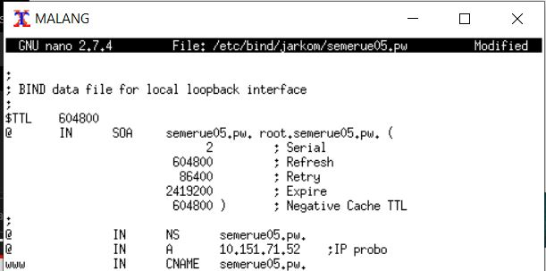
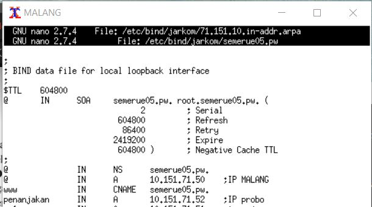
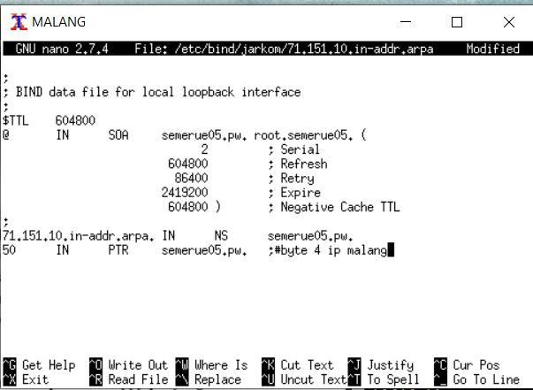
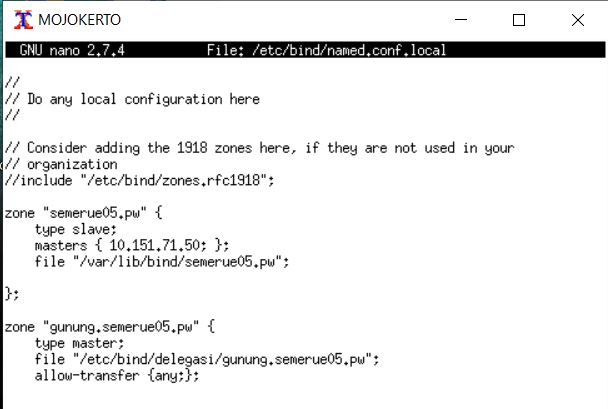

# Jarkom_Modul2_Lapres_E5
## Soal dan Jawaban
### 1. alamat http://semeruyyy.pw yang memiliki  
Jawaban :     
  
Revisi :  
  
  
### 2. alias http://www.semeruyyy.pw,  
Jawaban :     
  
Revisi :  
  
  
### 3. subdomain http://penanjakan.semeruyyy.pw yang diatur DNS-nya pada MALANG dan mengarah ke IP Server PROBOLINGGO  
Jawaban :     
  
Revisi :  
  
  
### 4. reverse domain untuk domain utama.  
Jawaban :     
  
Revisi :  
  
### 5. DNS Server Slave pada MOJOKERTO agar Bibah tidak terganggu menikmati keindahan Semeru pada Website.  
Jawaban :     
  
Revisi :  
  
### 6. subdomain dengan alamat http://gunung.semeruyyy.pw yang didelegasikan pada server MOJOKERTO dan mengarah ke IP Server PROBOLINGGO.  
### 7. subdomain dengan nama http://naik.gunung.semeruyyy.pw, domain ini diarahkan ke IP Server PROBOLINGGO.  
Jawaban :     
  
### 8. Domain http://semeruyyy.pw memiliki DocumentRoot pada /var/www/semeruyyy.pw. Awalnya web dapat diakses menggunakan alamat http://semeruyyy.pw/index.php/home.  
Jawaban :     
  

---
## Kendala
- Kurang teliti masalah penamaan 'yyy' sehingga harus memperbaiki di tengah jalan
- Saat revisi terjadi error koneksi pada uml
- Segfault